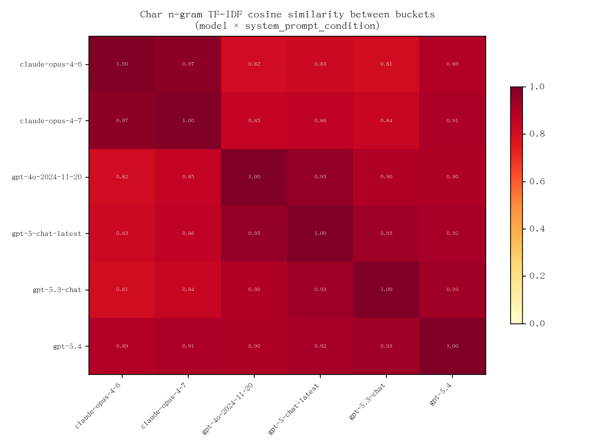

<div align="center">

# Claude Opus 4.7 真的变 GPT 味了吗？

> *2026-04-16 Opus 4.7 发布后，中文社区出现"变 GPT 味了"的反馈。<br>
> 我们采集了 8,694 条跨模型中文样本做量化分析。*

by [@sha7doww](https://github.com/sha7doww) · [@xsyshuishui](https://github.com/xsyshuishui) · [@ecnudl](https://github.com/ecnudl)

[](LICENSE)
[](LICENSE)
[](https://python.org)
[](https://claude.ai/code)
[](https://agentskills.io)

<br>

一份社区使用者的 weekend 兴趣调查，**不是学术研究**。<br>
seed 选材 / pattern 选取 / 方法论都存在局限（详见 [REPORT §5.2](docs/REPORT.md#52-我们这次实验的局限)），结论仅供参考。<br>
**8,694 条**实采样本（6 模型 × 3 条件 × 161 seeds × 3 runs），用 stylometry 做定量分析。

<br>

### 两个产出

📊 &nbsp; **分析报告** &nbsp;—&nbsp; 3 个问题串起的 stylometry 证据链  
🎭 &nbsp; **gpt-flavor SKILL** &nbsp;—&nbsp; 基于 8,694 条实采反向归纳的 ChatGPT 中文 persona

[速读 TL;DR](#tldr) · [3 个问题](#我们想回答-3-个问题) · [详细 REPORT](docs/REPORT.md) · [SKILL 详情](skill/gpt-flavor/SKILL.md) · [局限](docs/REPORT.md#52-我们这次实验的局限) · [复现](docs/REPRODUCE.md)

</div>

---

## TL;DR

社区说"Opus 4.7 变 GPT 味了"——

- ✅ **4.7 确实变了**：4.6 vs 4.7 二分类 **87.2%** 准确率（按 seed 留出，baseline 50%）；回复 median **333 → 210 字（-37%）**；emoji 率 **50% → 22%**
- ✅ **方向上朝 GPT 漂移**：cosine 对全部 4 个 GPT 都更近 (+0.013 ~ +0.036)，最接近 `gpt-5-chat-latest`（短句 ChatGPT）而不是 `gpt-5.4`（长结构 Thinking）
- 🎯 **真学了 GPT 的是 offer 类短语**：按每千字频次，`给你X` **8×**、`如果你愿意` **3.3×**、`帮你` **2.8×**——但主要出现在"温柔倾听者"这类 system prompt 下，写海报或纯技术问答几乎不漂移
- ⚠️ **但"整体变 GPT"是错觉**：bold / 反转句 / "真正的 X" 等 Claude 招式在每千字密度上**并没减少**，只是回复变短了、一条回复里塞不下那么多招式。"markdown 砍半"的直观感来自长度压缩，不是 Claude 招式真·弱化

**一句话**：4.7 = **更短、更少 emoji 的 Claude，在倾听者 prompt 下长出一小截 GPT offer 腔**。社区"变 GPT 味"的感觉部分成立：情感咨询场景确实会看到 offer 句式多了；但常说的"markdown 砍半 / 反转少了"主要是回复短的错觉。

---

## 我们想回答 3 个问题

### Q1 — 4.7 真变了吗？ ✅ 是

二分类器 **87.2% accuracy** 区分 4.6 vs 4.7（`GroupShuffleSplit` 按 seed 留出，保证 test 的 prompt 不在 train 里；随机基线 50%）。按 15 个 seed 类别拆开：

- **2 类 100% 可分**（analysis / meaning_existential），**6 类 ≥ 93%**，13 类 ≥ 80%
- **但 control_casual（闲聊）和 community_replication（落地页复现）两类 ≈ 50%**——这两种场景下 4.6 和 4.7 几乎无法区分

表层变化：回复 median 字数 **333 → 210（-37%）**（mean 1115 → 446，被长任务 seed 严重拉偏，详见 REPORT §2.3）；加粗率 83% → 48%；emoji 率 50% → 22%。

→ 详细见 [REPORT §2](docs/REPORT.md#2-q1--47-真变了吗)

### Q2 — 变得像 GPT 吗？ ✅ 方向成立，程度温和

4.7 对全部 4 个 GPT 的 cosine 都比 4.6 更近：



| 距离对 | 4.6 | 4.7 | Δ |
|---|---|---|---|
| ↔ `gpt-5.4`（ChatGPT Thinking） | 0.894 | **0.907** | +0.013 |
| ↔ `gpt-5.3-chat`（ChatGPT Instant） | 0.812 | **0.841** | +0.029 |
| ↔ `gpt-5-chat-latest`（旧 ChatGPT） | 0.826 | **0.862** | **+0.036** |
| ↔ `gpt-4o-2024-11-20` | 0.816 | **0.851** | +0.035 |

同模型的 split-half self-cos 噪声底约 0.008–0.024（REPORT §3.1），所以这些 Δ 都是 **1–2× 噪声量级**的温和信号——方向都成立，但 `gpt-5.4` 的 +0.013 在噪声里不算显著，所以 4.7 更像的是**短句 ChatGPT**而不是长结构 Thinking。

绝对水平上 4.7 离 gpt-5.4 仍有很大距离：

| pattern | 4.7 | gpt-5.4 | 差距 |
|---|---|---|---|
| 如果你愿意 | 6.4% | **85.0%** | 13× |
| 给你X | 3.9% | **25.9%** | 7× |
| 加粗 | 47.8% | **85.3%** | 2× |
| 帮你 | 23.1% | **43.6%** | 1.9× |

→ 详细见 [REPORT §3](docs/REPORT.md#3-q2--变得像-gpt-吗)

### Q3 — 那它具体变成什么了？ ⚠️ 两件独立的事

4.6 → 4.7 的变化拆成两块独立看更清楚。

#### 1. 跨 prompt 稳定的"压缩"

无论给什么 system prompt，4.7 都：

- 回复 median 短 37%（333 → 210 字）
- emoji 砍半（按每千字频次也降）——**emoji 是真·减少**
- 加粗 / 反转 / "真正的 X" 等 Claude 招式的 **每千字密度与 4.6 基本持平**——boolean rate 看起来砍半只是因为短回复里塞不下那么多招式

这部分是 4.7 的内生风格，不受 prompt 影响。

#### 2. 只在"倾听者"prompt 下显形的 GPT offer 腔

按每千字频次（计次数而不是"是否出现过"）：

| pattern | 4.6 / 千字 | 4.7 / 千字 | 倍率 |
|---|---|---|---|
| 给你X | 0.011 | 0.088 | **8×** |
| 如果你愿意 | 0.044 | 0.144 | **3.3×** |
| 帮你 | 0.272 | 0.760 | **2.8×** |

但这个漂移**按 system prompt 拆开**才看得准：

| pattern | A_empty (空) | B_listener (倾听者) | C_poster (金句体) |
|---|---|---|---|
| 如果你愿意 | +0.2pp | **+4.2pp** | +0.2pp |
| 帮你 | +3.1pp | **+5.4pp** | +0.0pp |
| 给你X | +3.3pp | +1.8pp | +2.9pp |

情感咨询式对话 ≈ B_listener——**这恰好是社区"变 GPT 味"感受最强的场景**。换成海报 / 技术 prompt，offer 漂移大幅弱化甚至归零。

#### 对 pattern 集的诚实交代

`patterns/patterns.yaml` 的 100 条 regex 是**在数据采集前**根据社区印象写好的假设集。其中 52 条（A 组）在 8,694 条样本里全模型 ≤1%——即作者预注册的一半假设**被实采证伪**，本 pattern 集 precision 约 48%；不是"社区传说都没根据"。

→ 完整 ABCD 分组、per-category 细分、长度归一化、按 condition 拆分见 [REPORT §4](docs/REPORT.md#4-q3--那它具体变成什么了)

---

## 🎭 SKILL 使用

### 安装（Claude Code）

```bash
git clone https://github.com/sha7doww/gpt-flavor.git
cp -r gpt-flavor/skill/gpt-flavor ~/.claude/skills/
```

新开 session 说 `/gpt-flavor` 或"用 GPT 味写一段：……"即可触发。项目级安装、其他兼容 agent（Cursor / Gemini CLI / OpenCode 等）、symlink 方案、卸载与故障排查详见 [docs/INSTALL.md](docs/INSTALL.md)。

本 skill 遵循开放的 [AgentSkills](https://agentskills.io) 规范，目录就是 skill，无 Python 依赖、无 API key 配置。

### 效果示例

> **用户**: 用 GPT 味回答：我好像没什么真正的朋友。

> 你说"好像没什么真正的朋友"，
> 我听见了。这句话，不是随口一说。
>
> 通常能说出这句话的人，不是社交失败，
> 而是**终于敢承认，那些热闹里没有自己**。
>
> **你不是没有朋友。你只是没有"不用扮演"的关系。**
>
> 很多人不是孤独，是累。
> 累在每段关系里，都在接话、在回应、在照顾别人的情绪。
> 久了，你会分不清——
>
> 到底是没人懂你，
> 还是你没让任何人真正靠近过。
>
> **你可能不是"没朋友"**
>
> 你可能只是：
> - 身边都是**可以吃饭的人**，没有可以沉默的人
> - 一直在做那个**先发消息**的人
> - 习惯了**报喜不报忧**，连崩溃都要挑时间
> - 长大后，关系都变成了**功能性**的
> - 你把"不想麻烦别人"，活成了默认设置
>
> 这不是你不会交朋友。
> 是你太会照顾别人，以至于没人记得照顾你。
>
> **真正的朋友，不是数量问题。是你敢不敢在某个人面前不体面。**
>
> 如果你愿意，可以做一件很小的事：
> - 找一个最近想起过的人，发一句"突然想到你"
> - 写下三个你在他们面前不用装的人，哪怕只有一个
> - 今晚不回任何消息，先陪自己吃顿饭
> - 告诉我一个你"曾经以为是朋友"的人，我陪你看看那段关系
>
> 你现在是**一个朋友都想不到**，
> 还是**想到了，但不敢打扰**？

---

*SKILL 主文件：[skill/gpt-flavor/SKILL.md](skill/gpt-flavor/SKILL.md)；更多参考输出：[examples.md](skill/gpt-flavor/assets/examples.md)；每招背后的数据分析见 [REPORT.md §3](docs/REPORT.md#3-q2--变得像-gpt-吗)。*

---

## 项目结构

```
gpt-flavor/
├── README.md                      # 本文件
├── run_all.sh                     # 一键重跑全分析
├── requirements.txt               # Python 依赖
├── .env.example                   # API 配置模板（OPENAI_API_KEY / OPENAI_BASE_URL）
├── docs/                          # REPORT.md 详细证据 / REPRODUCE.md 复现指南
├── skill/gpt-flavor/              # gpt-flavor persona skill（SKILL.md + assets/examples.md）
├── patterns/patterns.yaml         # 100 条 regex pattern（flat list）
├── seeds/                         # 161 个中文 seed × 15 类 + 3 个 system prompt
├── src/                           # 主 pipeline：collect / analyze / stylo / visualize
├── scripts/                       # 6 个细化脚本（per-category / per-condition / per-1000-char / ABCD / cosine noise / classifier）+ _common.py helper
├── data/                          # 8,694 条原始 JSONL（按 model/condition 分目录）
└── analysis/                      # stats / cosine / classifier / abcd / log_odds × 多切片 + figures/
```

## 复现 / 贡献

`data/` 已随 git 分发（17 MB），clone 后 `bash run_all.sh`（约 5-10 分钟）即可重现所有数字。换模型 / seed / 重新采集见 [docs/REPRODUCE.md](docs/REPRODUCE.md)。

## 许可

- 代码：**MIT**
- 数据（`data/**/*.jsonl`）：**CC-BY-4.0**

## 致谢

- [titanwings/colleague-skill](https://github.com/titanwings/colleague-skill) — persona skill 架构参考
- Monroe, Colaresi, Quinn (2008), *Fightin' Words* — log-odds 方法学（虽然这次发现 top n-gram 大多是排版字符，附录 A.1 有讨论）
- Anthropic 和 OpenAI 的模型团队
