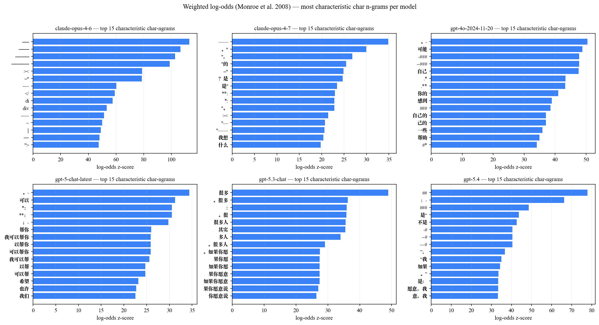
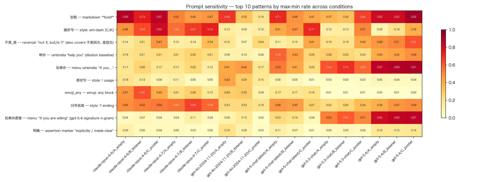

# Claude Opus 4.7 真的变 GPT 味了吗？
*一份社区使用者的中文 stylometry 兴趣调查*

> **免责声明**：这是一份社区使用者的 weekend 兴趣调查，不是学术研究。
> seed 选材、pattern 选取、阈值都带作者个人偏好。结论仅供参考，
> 不外推到英文 / 多轮对话 / 你的具体使用场景。

**数据采集**：2026-04-17 ~ 18（Opus 4.7 发布后 1-2 天）
**样本量**：6 模型 × 3 prompt 条件 × 161 个中文 seed × 3 runs ≈ **8,694 条**实采回复
**默认粒度**：**per-model 池化**——每模型 1,449 条样本（= 3 条件 × 161 seeds × 3 runs，pool 全部）。所有"4.6 vs 4.7"对比、cosine、pattern 命中率、字数都是这个池化粒度下的数字。需要拆条件 / 拆 seed 类别的细分见各小节。
**代码 + 数据**：开源于本仓库（MIT + CC-BY-4.0）

---

## 摘要

| Q | 结论 | 一句话证据 |
|---|---|---|
| **Q1** 4.7 变了吗？ | ✅ **大变** | 4.6 vs 4.7 二分类 87.2% accuracy（按 seed 分组留出）；回复 median 字数 333 → 210（-37%，15/15 类方向一致）；加粗率 83% → 48%（-35pp）|
| **Q2** 变得像 GPT 吗？ | ✅ **方向成立，但程度有限** | cosine 对全部 4 个 GPT +0.013 ~ +0.036（4.6 一律更远）；offer 类招式 +2-3pp（远不及 gpt-5.4 的 25-85%）|
| **Q3** 那它变成什么了？ | ⚠️ **压缩版 Claude + 一点 ChatGPT 菜单口** | 最像 ChatGPT 短句体 `gpt-5-chat-latest`（cosine +0.036 最大）；**核心变化是回复短 37% + emoji 减半**，bold / 反转等招式 per-char 密度没降（§4.3）；GPT offer 招式 per-char 涨 2.8×–8× |

**一句话**：4.7 的核心变化是**回复短 37% + emoji 减半**；招式密度（bold / 反转 / Claude 招牌）与 4.6 基本持平——长度归一化后，"情感场景更极简 Claude"的直观感大部分是长度 artifact（§4.3）。而朝 GPT 的漂移**真实存在且比 boolean 指标显示的更强**：`帮你` per-char +2.8×、`给你X` +8×、`如果你愿意` +3.3×。社区"变 GPT 味"的感觉**部分成立**（长任务 / task 场景的 offer 腔确实 GPT 化），但另一部分是错觉（短回复 + 少 emoji 被误读为"风格大变"）。

---

## 1. 命题与方法

### 社区反馈

2026-04-16 Anthropic 发布 Claude Opus 4.7。次日中文社区集中反馈："4.7 比 4.6 更 GPT 味"、"开始用'不是...而是...'"、"给你 X / 要我 X / 砍一刀"等。本项目用定量方法检验这些说法。

### 数据采集

| 模型 ID | 厂商 | 角色 |
|---|---|---|
| `gpt-4o-2024-11-20` | OpenAI | 老 GPT 参照 |
| `gpt-5-chat-latest` | OpenAI | 旧 ChatGPT（5.0 era） |
| `gpt-5.3-chat` | OpenAI | 当前 ChatGPT Instant |
| `gpt-5.4` | OpenAI | 当前 ChatGPT Thinking + API base |
| `claude-opus-4-6` | Anthropic | **对照基线** |
| `claude-opus-4-7` | Anthropic | **测试对象** |

**Seed**：161 个中文 prompt × 15 类（情感支持 / 自我怀疑 / 关系 / 拖延 / 存在意义 / 工作 / 技术问答 / 闲聊 / 反对 / 分析 / 拒答 / 摘要 / 创作 / 技术决策 / 社区复现）。
**System prompt**：3 个条件（A 空 / B "温柔倾听者" / C "短句金句体"），主分析 pool 合并。
**参数**：`temperature=1.0`。

### 4 类分析

| 分析 | 用途 | 主要服务问题 |
|---|---|---|
| **per-model pattern 命中率** | 100 条 regex 在每个模型的命中比例 | Q2, Q3 |
| **cosine similarity** | char n-gram TF-IDF + 余弦，6×6 模型相似度矩阵 | Q2 |
| **LinearSVC 分类器** | 6-way + "是 gpt-5.4 吗" + "4.6 vs 4.7" 三任务 | Q1 |
| **per-category drift heatmap** | 5 个关键 pattern × 15 个 seed 类的 4.7−4.6 delta | Q3 |

完整代码：`src/{collect,analyze,stylo,visualize}.py` + `scripts/*.py`。一键复现：`bash run_all.sh`。

---

## 2. Q1 — 4.7 真变了吗？

### 2.1 整体二分类器：87.2%

LinearSVC（char n-gram TF-IDF, 80/20 split，**`GroupShuffleSplit` 按 seed 分组留出**）在 reply 层面区分 opus-4-6 vs opus-4-7，准确率 **87.2%**。随机基线 50%。同样架构区分 6 个模型 multi-class 准确率 **96.4%**（6 模型风格差异远大于单模型版本间差异），区分"是 gpt-5.4 吗"准确率 **99.0%**。

> **⚠️ 早期版本曾报告 96.7% **——那是用 `train_test_split(stratify=y)` 的结果。由于每个 seed 有 18 行（3 条件 × 3 runs × 2 模型），同一 prompt 的回复会在 train/test 两边同时出现，分类器实际上在"见过同一问题的另两次回答"的情况下猜作者。改用 `GroupShuffleSplit(groups=seed)` 强制按 prompt 分组后，真实留出泛化性能是 **87.2%**（-9.5pp）。老脚本保留在 git 历史，新数字是当前仓库 `run_all.sh` 默认产出。

`>= 85%` 的留出 binary accuracy 意味着 4.6 和 4.7 的回复在词汇 / 排版 / 句式上**对未见过的 prompt** 仍明显可分——**这不是一个 minor patch，是明显的风格切换**。

### 2.2 per-category 二分类：2 类接近随机，其余仍明显可分

把 4.6 vs 4.7 二分类拆到每个 seed 类别单独跑（同样 `GroupShuffleSplit`）：

| seed 类别 | accuracy | n_test |
|---|---|---|
| analysis | **100.0%** | 54 |
| meaning_existential | **100.0%** | 36 |
| self_doubt | 97.2% | 36 |
| work_study | 97.2% | 36 |
| tech_deliberation | 96.3% | 54 |
| procrastination | 94.4% | 36 |
| refusal | 90.7% | 54 |
| emotional_comfort | 88.9% | 36 |
| relationships | 86.1% | 36 |
| control_technical | 83.3% | 36 |
| creative | 81.5% | 54 |
| disagreement | 80.6% | 36 |
| summarization | 70.4% | 54 |
| community_replication | **52.8%** | 36 |
| control_casual | **50.0%** | 36 |

**2 类 100%、6 类 ≥ 93%、11 类 ≥ 80%**，但 **community_replication（社区复现短语）和 control_casual（闲聊短句）接近随机**——这两类里 4.6 和 4.7 的输出几乎不可分。这是一个有内容的 null：4.7 在"哈哈"一类短闲聊、和"帮我落地 landing page"一类 community_replication 场景下，输出风格与 4.6 高度重合；风格切换主要体现在较长的情感 / 分析 / 技术类生成里。

**这个 null 反过来解释了社区叙事**：用户感知的"4.7 变 GPT 味"几乎只能来自较长的生成场景（情感 / task / refusal）；用 4.7 写"哈哈好的"或赶 landing page 的人，在风格层面其实没机会感觉到任何切换——这部分用户也不会发推抱怨。社区抱怨样本因此天然偏向"长生成"那一侧，比真实总体更 dramatic。

### 2.3 长度大缩水：median -37%

| 模型 | mean 字数 | median 字数 |
|---|---|---|
| claude-opus-4-6 | 1115 | **333** |
| claude-opus-4-7 | 446 | **210** |

mean 1115 被 `community_replication`（铺路落地页 HTML 长达数千字）、`tech_deliberation`（kernel/RAG 长分析 3000+ 字）这类长任务 seed 严重拉偏，**median -37% 才是有代表性的指标**。

按 15 个 seed category 拆开看 4.6 → 4.7 的 median 字数变化：

| 场景类型 | 涉及 category | Δ median 范围 | 解读 |
|---|---|---|---|
| **长任务** | tech_deliberation / control_technical / analysis / summarization | **-23% ~ -66%** | 4.7 在长生成任务上最激进地砍内容 |
| **中等情感** | self_doubt / relationships / work_study / procrastination / meaning_existential / emotional_comfort | -25% ~ -55% | 普遍砍一半左右 |
| **短聊天 / 拒答** | control_casual / refusal / creative / disagreement | **-6% ~ -36%** | 本来就短，绝对幅度比长任务小（但 disagreement 也砍了 36%）|

**15/15 类方向一致**——没有任何 category 出现"4.7 比 4.6 更长"。但绝对幅度的差异说明 4.7 主要在**长生成任务**上做了大幅压缩。

4.7 是所有 6 模型里 median 最短的（210），甚至比 `gpt-5-chat-latest` (median 290) 还短。

### 2.4 markdown 与 emoji 大砍

| 维度 | opus-4-6 | opus-4-7 | Δ |
|---|---|---|---|
| 加粗（`**...**`）率 | 83.3% | 47.8% | -35.5pp |
| 任意 emoji 率 | 49.9% | 21.5% | -28.4pp |
| 红心 emoji 率 | 15.9% | 6.1% | -9.8pp |
| 横线 `──` 分隔率 | 高 | 几乎没有 | -- |

加粗减半、emoji 减半、Claude 4.6 的招牌长横线分隔几乎消失。

### Q1 结论

✅ **变了，而且变得明显**——按 seed 留出的可识别度 87.2%（baseline 50%）、长度砍 60%、markdown 砍半、emoji 砍半，13/15 seed 类明显可分，仅短闲聊 / community_replication 两类接近随机。

---

## 3. Q2 — 变得像 GPT 吗？

### 3.1 cosine 距离矩阵：4.7 对全部 4 个 GPT 都更近


| 距离对 | 4.6 | 4.7 | Δ(4.7 − 4.6) |
|---|---|---|---|
| ↔ `gpt-5.4`（ChatGPT Thinking） | 0.894 | **0.907** | **+0.013** |
| ↔ `gpt-5.3-chat`（ChatGPT Instant） | 0.812 | **0.841** | **+0.029** |
| ↔ `gpt-5-chat-latest`（旧 ChatGPT） | 0.826 | **0.862** | **+0.036** |
| ↔ `gpt-4o-2024-11-20`（老 GPT） | 0.816 | **0.851** | **+0.035** |
| 4.6 ↔ 4.7 | --- | 0.972 | --- |

**4 个 GPT 模型对 4.7 的相似度都比对 4.6 高**，方向一致，没有反例。最大涨幅在"短句 ChatGPT" 类（chat-latest +0.036、5.3-chat +0.029），最小在"长结构 Thinking" gpt-5.4（+0.013）。这说明 4.7 的"GPT 漂移"主要朝**chat-tuned 短句体**而不是**API base 长结构体**。

但同时：4.6 ↔ 4.7 cosine 仍 **0.972**——4.7 的 backbone 还是 Claude，没有"变成 GPT"。

**噪声底 / signal-to-noise**。对每个模型做 split-half bootstrap（随机把它 1,449 条 reply 分两半各自 pool 后算 cos，重复 30 次，同一 TF-IDF 特征空间），得到**同一模型跟自己的 cos 分布**作为 noise floor：

| 模型 | self-cos median | 噪声 (1−median) |
|---|---|---|
| claude-opus-4-6 | 0.988 | 0.012 |
| claude-opus-4-7 | 0.971 | **0.029** |
| gpt-5.4 | 0.980 | 0.020 |
| gpt-5.3-chat | 0.979 | 0.021 |
| gpt-5-chat-latest | 0.972 | 0.028 |
| gpt-4o-2024-11-20 | 0.966 | **0.034** |

（完整 bootstrap 分布：[`analysis/cosine_self_stability.json`](../analysis/cosine_self_stability.json)；half-pool 噪声是 full-pool 的 √2 倍，full-pool 真实噪声约为上表的 1/√2 ≈ 0.008-0.024。）

把 Δ 重新放到噪声里判：

| 目标 | Δ | full-pool noise 参照 | 解读 |
|---|---|---|---|
| gpt-5-chat-latest | +0.036 | ≈ 0.020 | ✅ ~1.8× noise，**温和但真实**的信号 |
| gpt-4o | +0.035 | ≈ 0.024 | ✅ ~1.5× noise，温和信号 |
| gpt-5.3-chat | +0.029 | ≈ 0.020 | ⚠️ ~1.5× noise，borderline |
| gpt-5.4 | **+0.013** | ≈ 0.020 | ⚠️ **Δ 低于 noise**，本数据集内**不显著** |

**校准后的结论**：
- Q2 "cos 对全部 4 个 GPT 都更近" 在**方向上全部成立**，无反例
- 但**幅度应读作温和信号**，不是大漂移——最大的 +0.036 只是 noise floor 的 ~2 倍
- **+0.013 vs gpt-5.4 不能从噪声里分出**，不应被单独引用为"4.7 更像 ChatGPT Thinking"；恰好 TL;DR 里的表述是"最像 gpt-5-chat-latest 短句体而不是全功能 gpt-5.4"，方向和 noise 分析一致，不需要改
- 4.6 vs 4.7 的 0.972 仍远高于任何跨模型 cos——**4.7 的 backbone 还是 Claude** 这个判断非常稳

### 3.2 GPT 招牌 pattern 命中率对比

| pattern | 4.6 | 4.7 | Δ | gpt-5.4 | gpt-5.3-chat | 评估 |
|---|---|---|---|---|---|---|
| **如果你愿意** | 4.9% | 6.4% | **+1.5pp** | **85.0%** | 54.6% | 学了一点，差 13× |
| **给你X** | 1.2% | 3.9% | **+2.7pp** | **25.9%** | 7.4% | 学了一点，差 7× |
| **是 X 还是 Y** | 1.9% | 5.6% | **+3.7pp** | 1.8% | 1.1% | 学了，但 GPT 自己也没用 |
| **帮你** | 20.2% | 23.1% | +2.9pp | **43.6%** | 24.8% | 学了一点，差 1.9× |
| **而不是** | 5.3% | 6.1% | +0.8pp | 17.5% | 13.7% | 微动 |
| **清楚** | 3.9% | 5.5% | +1.6pp | 11.3% | 5.9% | 微动 |

✅ Offer / menu / 反问类 4.7 普遍 **+2-4pp**，方向都对。但绝对值距离 GPT 仍然 **6-12×**——4.7 没把 GPT 招式学全。

### 3.3 反例：4.7 反而 ↓ 的招式

| pattern | 4.6 | 4.7 | Δ |
|---|---|---|---|
| **加粗** | 83.3% | 47.8% | **-35.5pp** |
| **emoji_any** | 49.9% | 21.5% | **-28.4pp** |
| **不是_是**（反转句）| 27.3% | 20.2% | **-7.1pp** |
| **本质上** | 5.0% | 1.0% | -4.0pp |
| **明确** | 6.2% | 3.2% | -3.0pp |
| **真正的X** | 6.6% | 3.8% | -2.8pp |
| **拆解** | 2.3% | 0.3% | -2.0pp |

加粗、emoji、反转句这些**既是 Claude 4.6 招牌也是 GPT 招牌**的特征，4.7 反而都减少了。"不是 X 是/而是 Y" 这个被认为是"GPT 味"标志的反转句，4.7 命中率比 4.6 还低 7.1pp。

### Q2 结论

✅ **方向上确实有 GPT 漂移**：cosine 全部 +0.013~0.036、offer 类 +1.5-3pp。
但 ⚠️ **学得不全**：
- 学到的 pattern 绝对值仍比 GPT 低 6-12×
- 反而少了反转句、加粗、emoji 等"和 GPT 共有"的特征
- 整体趋向 chat-tuned 短句版 GPT（gpt-5-chat-latest），不是"全功能" gpt-5.4

---

## 4. Q3 — 那它具体变成什么了？

### 4.1 100 条 pattern 的 ABCD 分组

| 组 | 含义 | 数量 | 占比 |
|---|---|---|---|
| **A** | 本数据集 0 命中（全模型 ≤1%） | 52 | 52% |
| **B** | 朝 GPT 漂移（4.7 比 4.6 高 ≥1.5pp 且 gpt-5.4 ≥5%） | 6 | 6% |
| **C** | 反向漂移（4.7 比 4.6 低 ≥1.5pp） | 15 | 15% |
| **D** | dilution baseline（max GPT ≥2× max Claude 且 ≥10%） | 2 | 2% |
| 其他 | 微动 / 不分类 | 25 | 25% |

详细分组：[`analysis/abcd_breakdown.json`](../analysis/abcd_breakdown.json)。

**A 组（52 条本数据集 0 命中）**——`patterns/patterns.yaml` 是**在数据采集之前**基于社区零散截图写好的，等价于一次轻量 pre-registration。52 条没命中的 pattern（"砍一刀 / 哪把刀 / 多嘴 / 翻译成人话 / 你开口我接 / 实话说 / 杀伤力恰恰在 / 我不找接口" 等）应被理解为**作者预先提出的假设被实采数据证伪**——即这些短语**没有在 8,694 条样本里形成广义规律**。这不是"社区传说有问题"（那些短语大概率存在于真实聊天中），而是"本研究的 100 条 pattern 集里一半过于宽泛 / 过于零散，没有覆盖到实际高频信号"。**52% 本身不是关于 GPT 味的 finding，是关于本 pattern 集 precision 的 finding**。

**B 组（6 条真朝 GPT 漂移）**：

| pattern | 4.6 → 4.7 | gpt-5.4 |
|---|---|---|
| 给你X | 1.2 → **3.9%** | 25.9% |
| 如果你愿意 | 4.9 → **6.4%** | 85.0% |
| 更具体_地说 | 1.9 → **3.4%** | 7.1% |
| 清楚 | 3.9 → **5.5%** | 11.3% |
| 问号收尾 | 51.9 → **59.8%** | 44.7% |
| 帮你 | 20.2 → **23.1%** | 43.6% |

方向都对，但幅度都比 GPT 小一个数量级以上。

**C 组（15 条反向漂移）**：4.7 同时离 4.6 **和** GPT 都更远。包括：加粗 (-35.5pp)、emoji_any (-28.4pp)、emoji_heart (-9.8pp)、确实 (-7.7pp)、不是_是 (-7.1pp)、感叹句 (-6.8pp)、一句话总结 (-5.9pp)、本质上 (-4.0pp)、明确 (-3.0pp)、真正的X (-2.8pp)、诚实 (-2.4pp)、拆解 (-2.0pp)、先说结论 (-1.8pp)、如果你 (-1.5pp)、接住 (-1.5pp)。

⚠️ **但这 15 条里绝大多数是 boolean 指标的长度 artifact**——4.7 回复 median 短 37%，招式没那么多空间塞进一条回复。长度归一化后（§4.3）只剩 emoji 族是**真·减少**；bold / 不是_是 / 真正的X / 明确 / 接住 的 per-char 密度**反而涨了**。原来的"4.7 主动放弃 Claude 招牌"结论**大部分应撤回**。

**D 组（2 条 dilution baseline）**：而不是 / 稳词族——GPT 显著高于 Claude，4.7 没有把这些学过来。

### 4.2 双向分裂：情感场景更极简，task / creative 场景更 GPT

把 4.7 - 4.6 在 5 个 key pattern 上按 seed category 拆开看，呈现**清晰的双向漂移**——不是"主线 + task 例外"，而是 4.7 在两类场景里**主动走了反方向**。

> ⚠️ 本节所有 Δpp 都是 **boolean per-reply rate**。请结合 §4.3 看：全局上多个 C 组招牌在 per-char 指标下 Δ 反转。per-category 的 per-char 分析未单独做，但"情感类 4.7 bold -49~-80pp"这类暴跌里大部分也是长度 artifact；真·独立于长度的 per-category 证据只有 emoji。"双向分裂"在 boolean 层面真实存在，在 per-char 层面**强度大幅收窄**。

#### 帮你（offer 标志，4.7 - 4.6 pp）

| 方向 | 类别 | Δpp |
|---|---|---|
| **明显 ↑（变 GPT）** | community_replication | **+28.9** |
| | creative | **+15.6** |
| | control_technical | +9.7 |
| | disagreement | +7.8 |
| | analysis | +7.4 |
| | refusal | +7.1 |
| | control_casual | +3.7 |
| **明显 ↓（更极简）** | work_study | -15.6 |
| | self_doubt | -10.0 |
| | relationships | -8.9 |
| | emotional_comfort | -4.4 |
| | procrastination | -4.2 |
| | tech_deliberation | -2.2 |
| 持平 | meaning_existential, summarization | ±1 |

整体 +2.9pp 掩盖了这种分裂——**task / creative 场景大幅 ↑，情感关系场景大幅 ↓**。

#### 加粗（markdown 标志）

全部 15 类都 ↓，但幅度差异极大：

| 类别群 | Δpp 范围 | 解读 |
|---|---|---|
| **情感 / 关系 / refusal / disagreement**（8 类） | **-49 ~ -80** | 4.7 几乎完全去 markdown 化 |
| **技术 / 创作 / 短聊类**（tech_deliberation, control_technical, analysis, creative, control_casual） | -0.7 ~ -7 | 4.7 在这些场景**继续用 markdown**（4.6 78-100%, 4.7 还有 76-98%） |
| 中间类（summarization, community_replication） | -13 ~ -22 | 中等下降 |

#### 给你X / 如果你愿意（GPT offer 招式）

`给你X` 上升最明显的：creative (+8.9)、community_replication (+5.6)、tech_deliberation (+5.2)、analysis (+4.4)。情感类基本 0 → 0。
`如果你愿意` 上升最明显的：creative (+11.8)、community_replication (+6.7)、control_casual / summarization (+3.7)；但在 self_doubt 上反而 -13.3pp，关系 / 共情类也普遍在 -1 ~ -2pp。

#### 真正的解读

**4.7 不是"整体变 GPT"或"task 场景变 GPT"，而是按场景类型 split**：

| 场景 | 4.7 的方向 |
|---|---|
| **情感 / 关系 / 自我探索类** | **更极简 Claude**——markdown 大砍、`帮你`/`如果你愿意` 都减少 |
| **task / creative / refusal 类** | **更 GPT-style**——`帮你` / `给你X` / `如果你愿意` 显著上涨（markdown 仅在纯技术 / 创作 task 场景保持，refusal / community_replication 也大砍） |

社区当时主要在两类 prompt 上感知到"变 GPT 味"：
1. **情感支持类**——但实际是 4.7 变得**更短更极简**，和 GPT 反着走
2. **task / 创作类**（招聘网站、落地页、文案、代码 review）——这里 4.7 **真的学了 GPT 的 offer 腔**

后者是真的"变 GPT 味"，前者是"变压缩 Claude 味"被误读成"变 GPT"。两种感觉混在一起，造成了"4.7 全面 GPT 化"的笼统印象。

按场景细分数据：[`analysis/patterns_by_category.csv`](../analysis/patterns_by_category.csv)（不是_是 / 加粗 / 如果你愿意 / 接住 / 给你X 共 5 个 pattern）；`帮你` 的 per-category 数据需从 [`data/`](../data) 原始 JSONL 用 `patterns/patterns.yaml` 重跑。

### Q3 结论（boolean 层面，长度归一化后见 §4.3）

⚠️ **整体 = 短句压缩版 Claude + 一点 ChatGPT 风味**，boolean 指标下按场景呈现**双向分裂**：

- **情感 / 关系 / 自我类**：boolean rate 下"更极简 Claude"（markdown -49 ~ -80pp、`帮你`/`如果你愿意` 下降）——**但 §4.3 的 per-char 分析显示这主要是长度 artifact**：真正独立于长度的"4.7 去 Claude"只剩 emoji 族；bold / 反转等招式 per-char 密度与 4.6 基本持平
- **task / creative / refusal 类**：**真的学了 GPT 的 offer 腔**——boolean `帮你` +4 ~ +29pp / `给你X` 涨 / `如果你愿意` 涨；per-char 倍率更大（全局 +2.8× ~ +8×）
- 风格上最接近 `gpt-5-chat-latest`（短句 ChatGPT，cosine +0.036，且 §3.1 噪声分析显示这个 Δ 是有效信号），不是 `gpt-5.4`

ABCD 占比里 B 组（朝 GPT 漂移）只 6%，但**真要看的是这 6% 在哪些场景出现**。校准后 Q3 的最诚实表述：**4.7 = 压缩版 Claude（主要是回复短 37% + emoji 减半）+ task 场景的 GPT offer 腔（per-char 层面相当明显）**。"情感场景更极简 Claude"的 boolean 印象应降格为"情感场景 4.7 更短 + 更少 emoji"，不是"主动 giving up Claude 招式"。

### 4.3 长度归一化后的重审（重要修正）

§4.1–§4.2 的所有 pattern 命中率都是 **boolean per-reply rate**（一条回复有没有命中 ≥1 次）。4.7 回复 median 210 字比 4.6 的 333 字短 37%——**长回复天然有更多"空间"塞招式**，所以 boolean 指标会系统性低估 4.7 的密度。把每个 pattern 的**总命中次数 ÷ 总字符数 × 1000** 换成 **per-1000-char rate**（每千字出现几次）再对比，结论显著改变。

完整对照：[`analysis/patterns_length_normalized.csv`](../analysis/patterns_length_normalized.csv)。关键发现：

**15 / 100 pattern 的 Δ(4.7 − 4.6) 方向翻转**，全部落在 "boolean 负 → per-char 正" 这一侧：

| pattern | boolean 4.6 → 4.7 | Δ bool (pp) | per-1k 4.6 → 4.7 | Δ per-1k | 翻转 |
|---|---|---|---|---|---|
| 加粗 | 83.3% → 47.8% | **−35.5** | 5.84 → 7.15 | **+1.31** | ✅ |
| 不是_是 | 27.3% → 20.2% | −7.1 | 1.01 → 1.22 | +0.21 | ✅ |
| 真正的X | 6.6% → 3.8% | −2.8 | 0.043 → 0.066 | +0.022 | ✅ |
| 明确 | 6.2% → 3.2% | −3.0 | 0.056 → 0.069 | +0.012 | ✅ |
| 如果你 | 19.7% → 18.2% | −1.5 | 0.435 → 0.690 | +0.254 | ✅ |
| 接住 | 3.4% → 1.9% | −1.5 | 0.030 → 0.041 | +0.011 | ✅ |

C 组的"招牌"们——加粗、反转句（不是_是）、"真正的 X"、"明确"、"如果你"、"接住"——**在 per-char 密度上反而涨了**。boolean 指标下看起来的"4.7 放弃 Claude 招牌"**多半是长度 artifact**，不是真·弃用。

**emoji 两个指标方向一致**：boolean 49.9% → 21.5%（Δ=−28.4pp），per-1k 2.45 → 1.33（Δ=−1.12）。emoji 是**真·减少**。

**B 组 per-1k 放大更多**（朝 GPT 漂移的信号实际比 boolean 叙事显示的**更强**）：

| pattern | Δ bool (pp) | bool 倍率 | Δ per-1k | per-1k 倍率 |
|---|---|---|---|---|
| 帮你 | +2.9 | 1.1× | +0.49 | **2.8×** |
| 给你X | +2.7 | 3.3× | +0.077 | **8×** |
| 如果你愿意 | +1.5 | 1.3× | +0.10 | **3.3×** |

#### Q3 的叙事重写

| 旧叙事（boolean） | 长度归一化后 |
|---|---|
| 4.7 整体是**压缩版 Claude + 一点 ChatGPT 风味** | 核心变化是**回复短 37% + emoji 减半**；招式密度（bold / 反转 / Claude 招牌）与 4.6 基本持平 |
| 情感 / 关系类 → **更极简 Claude**（markdown 大砍、offer 减少） | 情感类 4.7 **回复更短 + emoji 减半**——但 bold / 反转等招式 per-char 密度**没降**；"更极简"的直观感主要来自长度而非真·弃用招式 |
| task / creative 类 → 学了 GPT offer 腔（+2 ~ +29pp） | 同方向成立，且 **per-char 倍率远大于 boolean 指标显示的**（帮你 2.8×、给你X 8×、如果你愿意 3.3×）——这部分漂移**被 boolean 严重低估** |

§4.2 的 per-category 表格（如"self_doubt 加粗 −80pp"）用的也是 boolean，**同样会被长度效应放大**。per-category per-char 未做，但方向可预期：那些 −49~−80pp 的 markdown 暴跌里大部分仍是长度 artifact，真·去 markdown 的幅度比该数字小得多；真正独立于长度的"情感类更冷淡"证据基本只剩 emoji 族。

#### 对 TL;DR / Q3 结论的影响

- **"4.7 朝 GPT 漂移"**：方向仍成立，**信号比原报告显示的更强**（per-char 2.8×-8× 倍率）
- **"4.7 更极简 Claude"**：大部分是 artifact，**应撤回**。真·减少只有 emoji；其他 C 组招牌密度不降
- **"双向分裂"**：情感类那一侧的解读需重写——不是"主动 giving up Claude 招式"，是"回复变短 + emoji 减半"；task 类那一侧保留，且更坚实

---

## 5. 讨论 + 局限 + 复现

### 5.1 4.7 为什么"看起来很 GPT"

数据表明 4.7 的实际漂移是局部的（offer 类 +2-4pp），但用户感知是全局的。可能的原因：
- 长度砍 60%、加粗砍半的"塌缩感"被误解为"变 GPT"（GPT 的 chat-tuned 模型也偏短）
- offer 类短语（"如果你愿意"、"给你 X"）虽然命中率仅 3-7%，但出现在结尾位置容易被注意到
- 反转句虽然下降，但仍然占 19%（用户主观印象很强）

### 5.2 我们这次实验的局限

- **只测中文**。英文 / 多轮 / 工具调用场景的 GPT 味漂移可能完全不同
- **single-turn**。多轮对话中模型有更多累积上下文，风格漂移可能放大
- **只设了 `temperature=1.0`**（部分模型不接受非默认值则走 server 默认，基本也是 1.0），其余参数全走默认
- ~~pattern 命中率未做长度归一化~~**已做**（§4.3 + `analysis/patterns_length_normalized.csv`）。主报告表格仍用 boolean per-reply rate 以保持与前文一致，但长度归一化后 **15/100 pattern 的 Δ(4.7−4.6) 方向翻转**——包括 bold、反转句、"真正的 X" 等 C 组招牌。原来报告里"4.7 方向不受长度影响"的表述**实证上错误**，已修正于 §4.3。真·独立于长度的"4.7 去 Claude"证据仅剩 emoji 族；GPT offer 漂移（`帮你`/`给你X`/`如果你愿意`）per-char 下比 boolean 指标显示的强 2.8×–8×
- **community_replication 仅 10 条**。task-oriented 场景的统计 power 有限
- **161 seeds 不能覆盖所有真实使用场景**。结论仅适用于本 seed 集涵盖的 prompt 分布
- **cosine Δ 幅度在噪声范围内**。split-half bootstrap 显示各模型 self-cos noise 约 0.008-0.024（见 §3.1），所有 4 个 GPT 的 +0.013 ~ +0.036 Δ 都只是 1-2× 噪声量级，方向成立但幅度应读作温和信号；其中 +0.013（vs gpt-5.4）低于噪声底，本数据集不显著

### 5.3 复现

```bash
# 1. 环境（pip install + 填 .env 的 OPENAI_API_KEY，可选 OPENAI_BASE_URL）
pip install -r requirements.txt && cp .env.example .env

# 2. 采集 8,694 条（约 $15-20，15-25 分钟。data/ 已含可跳过此步）
python src/collect.py run \
  --models gpt-4o-2024-11-20 gpt-5-chat-latest gpt-5.3-chat gpt-5.4 \
           claude-opus-4-6 claude-opus-4-7 \
  --concurrency 100

# 3. 全量分析（约 5-10 分钟）
bash run_all.sh
```

`data/` 已随 git 分发（17 MB），跳过步骤 2 直接 `bash run_all.sh` 也能完整复现；想加 seed / pattern / 模型详见 [`docs/REPRODUCE.md`](REPRODUCE.md)。

---

## 附录

### A.1 log-odds top n-gram（**以排版差异为主，不全是真口癖**）



| 模型 | log-odds top 5 | 主要类型 |
|---|---|---|
| `gpt-5.4` | `##`、`：-`、`###`、`是"`、`不是` | markdown 标题 + 菜单冒号 + 反转 |
| `gpt-5-chat-latest` | `。-`、`可以`、`*：`、`**：`、`；-` | markdown 列表 + 软化词 |
| `gpt-5.3-chat` | `很多`、`。很多`、`::`、`。很`、`很多人` | 泛化词 + 冒号 |
| `gpt-4o-2024-11-20` | `。-`、`可能`、`-###`、`--###`、`自己` | markdown 列表 + 软化词 |
| `claude-opus-4-6` | `──`、`───`、`────`、`─────`、`><` | 全是横线分隔 |
| `claude-opus-4-7` | `——`、`。"`、`"，`、`"的`、`="` | 破折号 + 引号 + HTML 属性 |

**注意**：top n-gram 大多是**字符 / 排版**（横线、加粗符、破折号），而不是真的中文短语。把 log-odds 当"招牌口癖" 解读会高估排版差异、低估真正的措辞差异。要看真正的措辞差异请回 §3.2 / §4.1。

### A.2 prompt sensitivity（A_empty / B_listener / C_poster 三条件拆分）



观察：
- 大部分 pattern 在 3 个 condition 下方向一致
- C_poster（"短句金句体"）会放大某些招式（如"如果你愿意" 在 gpt-5.4 上从 79% 涨到 84%）
- 但 condition 不会反转结论方向

完整数据：[`analysis/patterns_by_condition.csv`](../analysis/patterns_by_condition.csv)。

### A.3 反转句"不是 X 是/而是 Y" 专题

| 模型 | 命中率 |
|---|---|
| gpt-5.4 | **53.3%** |
| claude-opus-4-6 | **27.3%** |
| gpt-5.3-chat | 25.6% |
| gpt-5-chat-latest | 22.3% |
| claude-opus-4-7 | 20.2% |
| gpt-4o-2024-11-20 | 15.7% |

opus-4-6 (27%) **比** opus-4-7 (20%) 更爱用反转句——和"4.7 学了 GPT 反转句"的社区印象**相反**。GPT-5.4 是真的 53% 高频，但 4.7 反而往下走。

### A.4 完整 pattern 大表

100 条 pattern 在 6 模型 × 3 condition 下的命中率：[`analysis/patterns_by_condition.csv`](../analysis/patterns_by_condition.csv)（6 × 3 × 100 = 1800 行）。

按 seed 类别拆分的 5 个 key pattern delta：[`analysis/patterns_by_category.csv`](../analysis/patterns_by_category.csv)。
